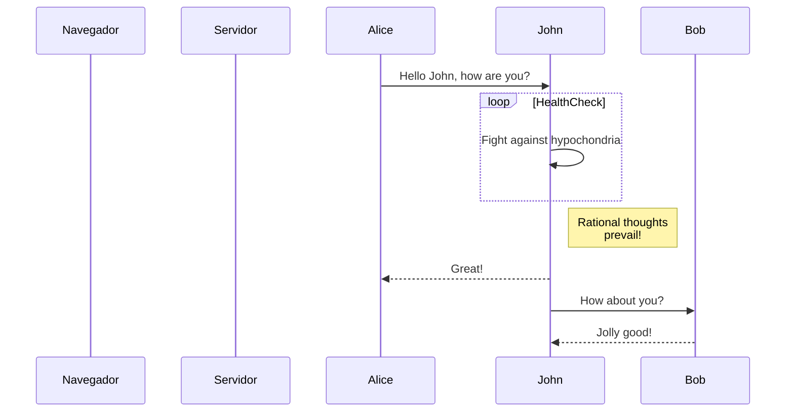

En este apartado creare markdowns para completar el apartado 0 del curso de FullStack Open de la universidad de Helsinki, Finlandia.

# Diagrama de Secuencias
 ### ** Navegador && Servidor**

```mermaid
sequenceDiagram
    participant Navegador
    participant Servidor
    Alice->>John: Hello John, how are you?
    loop HealthCheck
        John->>John: Fight against hypochondria
    end
    Note right of John: Rational thoughts <br/>prevail!
    John-->>Alice: Great!
    John->>Bob: How about you?
    Bob-->>John: Jolly good!
```
