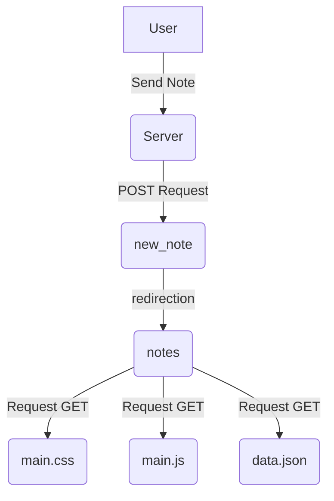
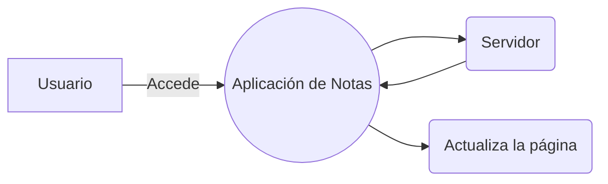
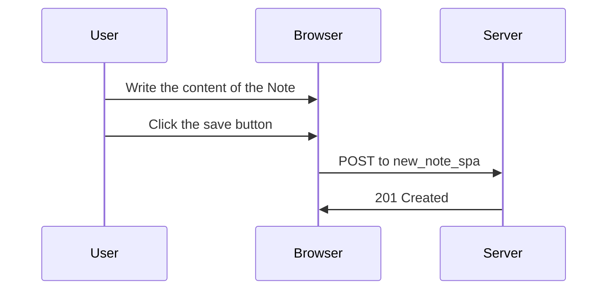

En este apartado creare markdowns para completar el apartado 0 del curso de FullStack Open de la universidad de Helsinki, Finlandia.

# Diagrama de Secuencias
 ### ** Browser && Server .... 0.4 ** 

> [!NOTE]
> User send a note from Browser, this triggers the from action and the HTTP post method to the new_note server direction.
>Server response is a HTTP 302, this is a URL refresh request to the browser, when executed, it creates HTTP GET to the URL before mentioned.
>Browser refresh notes page, triggering 3 HTTP requests, server then send main.css, main.js and data.json.

## **SPA 0.5 Explanation**

> [!NOTE]
> User send a note from Browser, this triggers the from action and the HTTP post method to the new_note server direction.
>Server response is a HTTP 302, this is a URL refresh request to the browser, when executed, it creates HTTP GET to the URL before mentioned.
>Browser refresh notes page, triggering 3 HTTP requests, server then send main.css, main.js and data.json.

### **SPA 0.6 Explanation. **

> [!NOTE]
> User write the content of the Note, then when he click the button to save, the browser send a POST to the addres new_note_spa to the server; the new note spa contains a JSON with all the content of the note, as well as a time stamp; the content_type tells the server that the data is represented as a JSON, withour that header the server couldn't handle the data. The server response with a 201 Created state, but this time the server doesn't request a refresh to the browser, doing this the page stays in that state withour requesting more HTTPS responses. JavaScript is the method used in this SPA, how it doit is like this: document.getElementById('notes_form') indicates to handle the event of sending the form, with the e.preventDefault() we prevent to handle the form to be send as per usual; instead, the controller of events creates a new note with the commnad notes.push(note) this render again the notes with the new information and send it to the server, once on the server, the code determines that the data will be send with a HTTP POST and the data type will be JSON, the header is determined by a content type, followed by sending the data as a JSON array.
