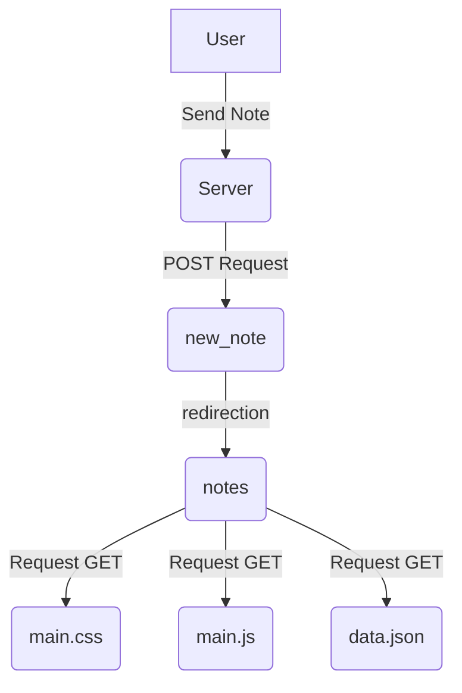

En este apartado creare markdowns para completar el apartado 0 del curso de FullStack Open de la universidad de Helsinki, Finlandia.

# Diagrama de Secuencias
 ### ** Browser && Server**

> [!NOTE]
> User send a note from Browser, this triggers the from action and the HTTP post method to the new_note server direction.
>Server response is a HTTP 302, this is a URL refresh request to the browser, when executed, it creates HTTP GET to the URL before mentioned.
>Browser refresh notes page, triggering 3 HTTP requests, server then send main.css, main.js and data.json.
