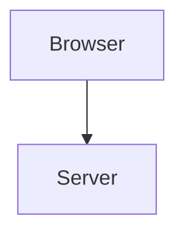
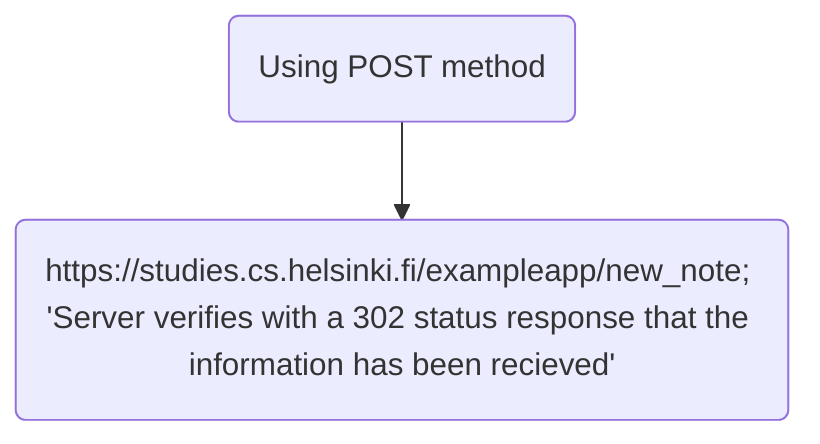

En este apartado creare markdowns para completar el apartado 0 del curso de FullStack Open de la universidad de Helsinki, Finlandia.

# Diagrama de Secuencias
 ### ** Browser && Server**

> [!NOTE]
> When we load the page the browser send a request to the server, when the server read the request, send the information so we can see the webpage.

> [!NOTE]
> We write in the form the text we want to send, then we click in the button SAVE. This triggers the new_note 302 Post Request, and it send to the server.
